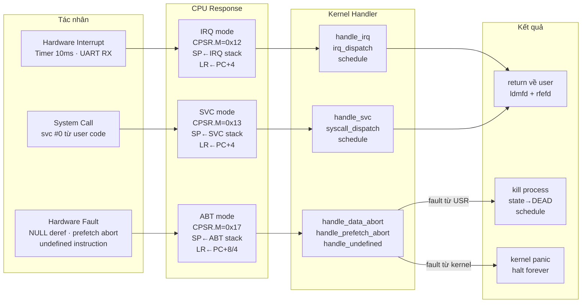
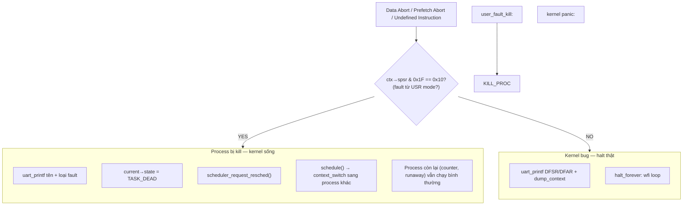

# 2. Xử lý Exception & Interrupt

> **Mục đích:** Cho thấy luồng từ khi hardware báo hiệu exception/interrupt đến
> khi handler xử lý xong và return về user mode.

## 2.1. Tổng quan các loại exception

## 2.2. IRQ path — chi tiết

Đường đi của 1 timer IRQ từ lúc GIC báo hiệu đến khi schedule và return.

```mermaid
flowchart TB
    subgraph STEP1["1. Hardware → CPU"]
        H1["Timer (SP804/DMTIMER2) fire sau 10ms"]
        H2["GIC assert IRQ line → CPU"]
        H3["CPU: nếu CPSR.I=0, chấp nhận IRQ<br/>CPSR.I←1 (mask lại)<br/>chuyển sang IRQ mode<br/>SP←IRQ stack · LR←PC+4"]
    end

    subgraph STEP2["2. Vector table"]
        V1["VBAR → offset 0x18 = IRQ vector"]
        V2["ldr pc, _vec_irq<br/>→ exception_entry_irq"]
    end

    subgraph STEP3["3. Entry stub (trampoline)"]
        E1["sub lr, lr, #4<br/>LR ← địa chỉ instruction bị ngắt"]
        E2["srsdb sp!, #0x13<br/>push {LR_irq, SPSR_irq} lên SVC stack"]
        E3["cps #0x13<br/>chuyển sang SVC mode"]
        E4["stmfd sp!, {r0-r12, lr}<br/>push 14 GPRs lên SVC stack"]
        E5["bl handle_irq"]
    end

    subgraph STEP4["4. C handler"]
        C1["handle_irq()"]
        C2["irq_dispatch()<br/>→ active_intc→ops→get_active<br/>→ irq_table[n]()  (timer_irq)"]
        C3["timer_irq()<br/>→ chip→ops→irq (ack hardware)<br/>→ timer_tick()"]
        C4["timer_tick()<br/>→ tick_count++<br/>→ user_handler = scheduler_tick"]
        C5["scheduler_tick()<br/>→ need_reschedule = 1"]
        C6["schedule()<br/>nếu need_reschedule:<br/>→ walk ring tìm next READY<br/>→ context_switch(prev, next)"]
    end

    subgraph STEP5["5. Return về user"]
        R1["ldmfd sp!, {r0-r12, lr}<br/>restore 14 GPRs từ SVC stack"]
        R2["rfefd sp!<br/>pop {PC, CPSR} từ SVC stack<br/>→ return về user mode<br/>→ CPSR.I ← 0 (enable IRQ)"]
    end

    STEP1 --> STEP2 --> STEP3 --> STEP4 --> STEP5

    style STEP3 fill:#fff3cd,stroke:#ffc107
    style STEP5 fill:#d4edda,stroke:#28a745
```

**Ghi chú thiết kế quan trọng:**

- **Trampoline pattern:** IRQ stack chỉ giữ vài register trong 3-4 instruction.
  `srsdb` push thẳng `{LR_irq, SPSR_irq}` sang SVC stack của process hiện tại
  — tránh dùng IRQ stack cho logic phức tạp.
- **Không nested IRQ:** CPSR.I bị set ngay khi vào IRQ mode. Handler chạy với
  IRQ tắt → không lo IRQ stack bị overwrite.
- **Schedule tail:** `handle_irq` gọi `schedule()` sau `irq_dispatch()` —
  nếu timer tick vừa set `need_reschedule`, process được swap trước khi `rfefd`
  return. Process mới nhận `rfefd` trỏ sang stack của nó.

## 2.3. Fault isolation

Đây là cơ chế cô lập lỗi cốt lõi: user process A crash → kernel + process B/C
tiếp tục chạy. Kernel giữ toàn quyền kiểm soát.
