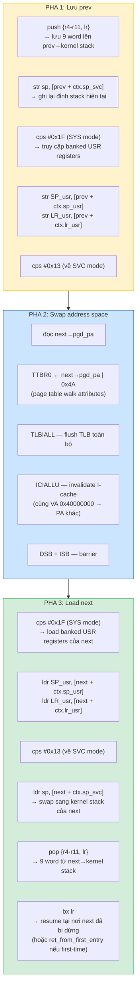
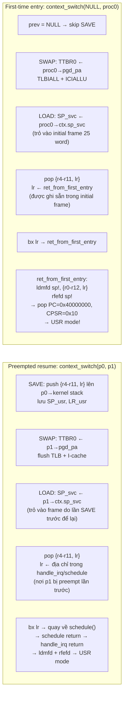
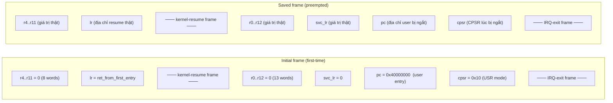

# 3. Context Switch

> **Mục đích:** Cho thấy chi tiết những gì diễn ra bên trong `context_switch(prev, next)`
> — hàm assembly quan trọng nhất để chuyển đổi giữa các process.

## 3.1. Tổng quan

## 3.2. First-time entry vs Preempted resume

**Điểm khéo:** Cùng 1 code path `context_switch` dùng cho cả first-time entry và
preempted resume. Sự khác biệt nằm ở nội dung kernel stack frame chứ không ở code.
First-time entry có `lr = ret_from_first_entry` (pre-built), còn preempted resume
có `lr` trỏ vào giữa `schedule()` (do lần SAVE trước tự push vào).

## 3.3. Kernel stack frame layout

- **Kernel-resume frame (9 word):** `context_switch` epilogue pop `{r4-r11, lr}` từ đây.
- **IRQ-exit frame (16 word):** `ret_from_first_entry` (first-time) hoặc
  `ldmfd + rfefd` (preempted) drain frame này để trở về USR mode.
- Tổng: 25 word = 100 byte trên đỉnh kernel stack 8 KB.
