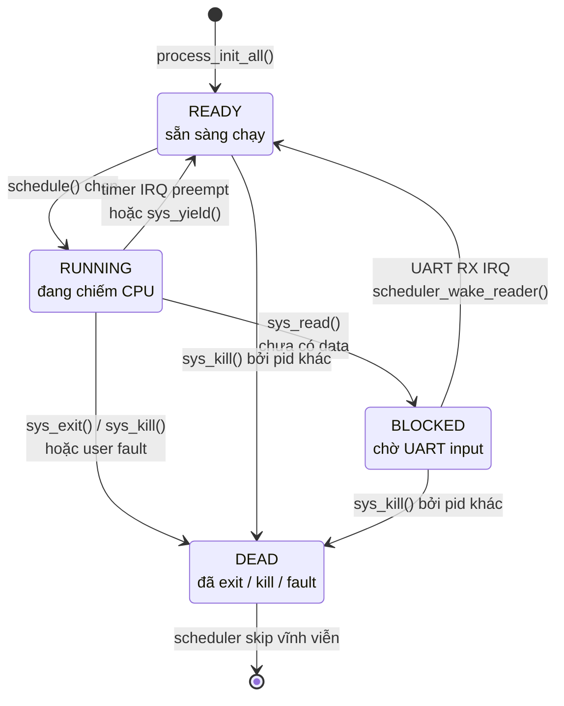
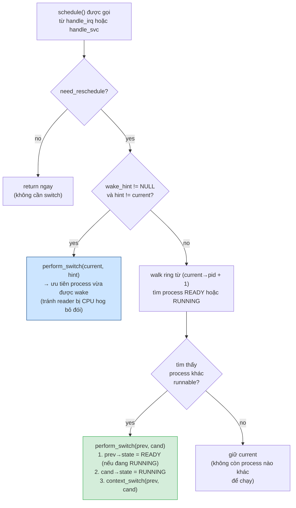
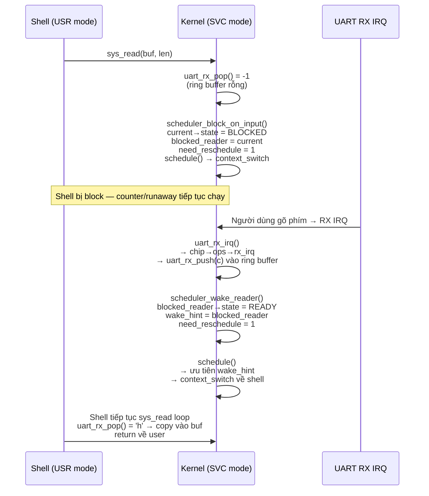

# 4. Scheduler

> **Mục đích:** Cho thấy state machine của process và thuật toán round-robin
> preemptive scheduler.

## 4.1. Process state machine

| State | Ý nghĩa | Còn trong run queue? |
|-------|---------|---------------------|
| `READY` | Sẵn sàng chạy, chờ được schedule pick | Có |
| `RUNNING` | Đang chiếm CPU (chỉ 1 process) | Có |
| `BLOCKED` | Chờ UART input — bị loại khỏi run queue | Không |
| `DEAD` | Đã exit/kill/fault — scheduler skip | Không |

## 4.2. Thuật toán round-robin

## 4.3. BLOCKED → READY wake-up path

**Điểm khéo:** `wake_hint` cho phép process vừa được wake (shell) nhận CPU ngay
trong lần `schedule()` tiếp theo, thay vì phải chờ hết vòng round-robin. Điều này
giữ cho interactive shell responsive ngay cả khi counter + runaway đều READY.
