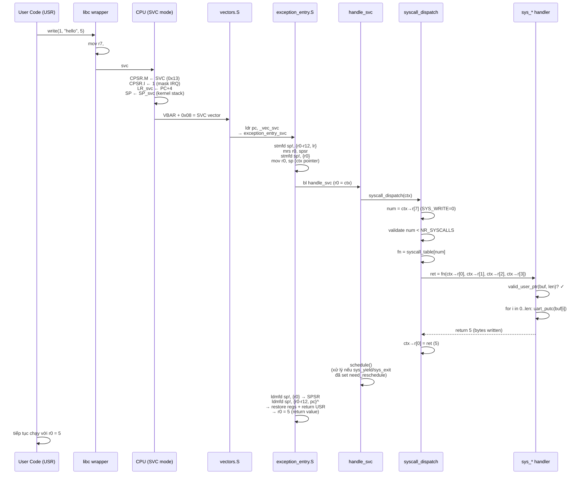
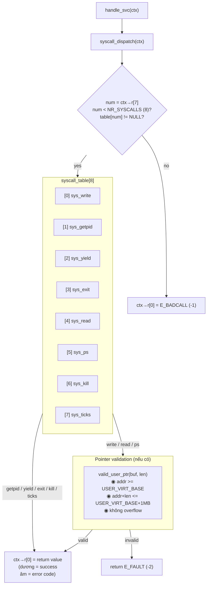

# 5. System Call

> **Mục đích:** Cho thấy luồng từ user code gọi `svc #0` đến kernel dispatch,
> xử lý, và return về user mode.

## 5.1. Tổng quan luồng syscall

## 5.2. Dispatch table

## 5.3. ABI — thanh ghi

| Register | Hướng | Vai trò |
|----------|-------|---------|
| `r7` | Input | Syscall number (0..7) |
| `r0` | Input | Argument 0 |
| `r1` | Input | Argument 1 |
| `r2` | Input | Argument 2 |
| `r3` | Input | Argument 3 |
| `r0` | Output | Return value |

## 5.4. Danh sách syscall

| # | Name | Args | Returns | Blocking? |
|---|------|------|---------|-----------|
| 0 | `write` | fd, buf, len | bytes written | Không |
| 1 | `getpid` | — | pid (0..2) | Không |
| 2 | `yield` | — | 0 | Không |
| 3 | `exit` | — | không return | Không |
| 4 | `read` | fd, buf, len | bytes read | **Có** — block nếu ring rỗng |
| 5 | `ps` | buf, size | bytes written | Không |
| 6 | `kill` | pid | 0 / E_BADCALL | Không |
| 7 | `ticks` | — | tick_count | Không |

`E_BADCALL = -1`, `E_FAULT = -2`. Các giá trị âm được user libc map sang errno.
