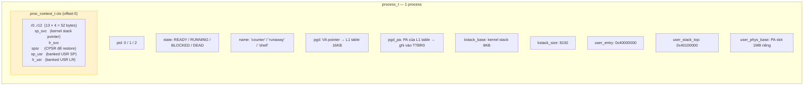
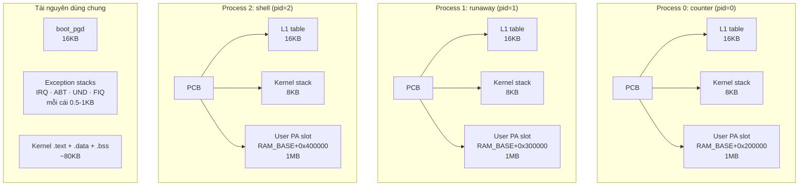
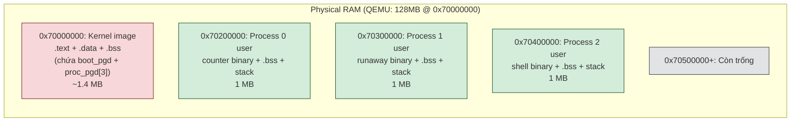
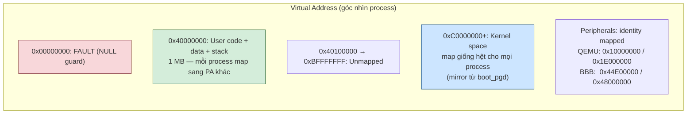

# 6. Process Management

> **Mục đích:** Cho thấy cấu trúc PCB và cách 3 process được tổ chức trong bộ nhớ.

## 6.1. Process Control Block

## 6.2. 3 process trong hệ thống

## 6.3. Bố trí Physical Memory

## 6.4. Virtual Memory view (mỗi process)

**Isolation thật sự:** Process A (counter) và process B (shell) cùng thấy user code
ở VA `0x40000000`, nhưng PA khác nhau → A ghi vào `0x40000000` không ảnh hưởng B.
MMU đảm bảo điều này qua per-process page table.
