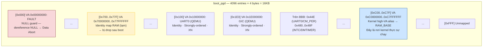
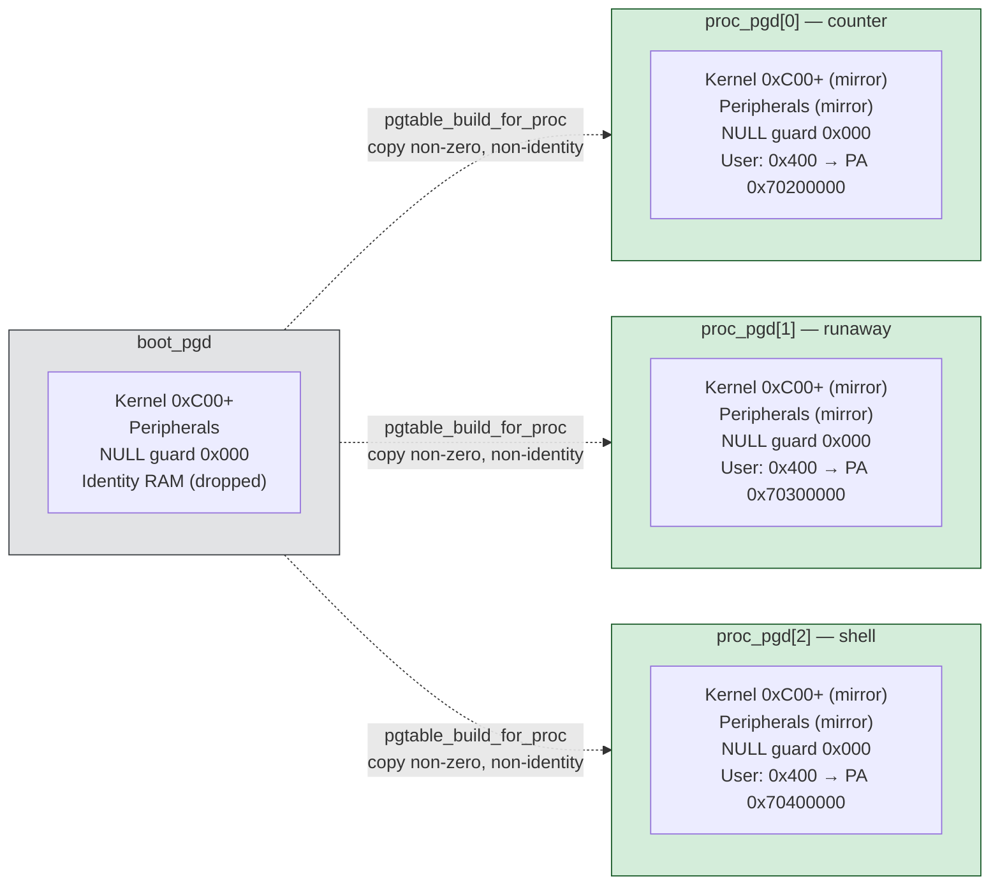

# 7. MMU — Memory Management Unit

> **Mục đích:** Cho thấy quá trình boot-time MMU transition và cấu trúc
> per-process page table.

## 7.1. Boot-time MMU transition

```mermaid
flowchart TB
    subgraph PHASE1["Pha 1: MMU off — PA world"]
        P1_1["CPU vào _start tại PA"]
        P1_2["Tính PHYS_OFFSET = VA - PA"]
        P1_3["Set SVC stack tại PA<br/>(sp = _svc_stack_top - PHYS_OFFSET)"]
        P1_4["Zero BSS tại PA"]
    end

    subgraph PHASE2["Pha 2: Build boot_pgd"]
        P2_1["mmu_init(phys_offset)"]
        P2_2["boot_pgd_va → boot_pgd_pa<br/>(dùng PA pointer để ghi L1 table)"]
        P2_3["mmu_build_boot_pgd:"]
        P2_4["◉ Identity: RAM_BASE → RAM_BASE<br/>   (giữ PC sống qua MMU enable)"]
        P2_5["◉ Kernel high VA: 0xC0000000 → RAM_BASE<br/>   (kernel chạy ở đây sau trampoline)"]
        P2_6["◉ Peripherals: identity, strongly-ordered, XN"]
        P2_7["◉ NULL guard: entry 0 = FAULT"]
    end

    subgraph PHASE3["Pha 3: Enable MMU"]
        P3_1["mmu_enable(pgd_pa):"]
        P3_2["DSB · ICIALLU · DSB · ISB"]
        P3_3["TTBR0 ← pgd_pa | 0x4A"]
        P3_4["TTBCR ← 0 (TTBR0 covers 4 GB)"]
        P3_5["DACR ← 0x1 (Domain 0 = Client)"]
        P3_6["TLBIALL · DSB · ISB"]
        P3_7["SCTLR ← M=1 · C=1 · I=1 · Z=1"]
        P3_8["ISB — MMU active!<br/>CPU vẫn chạy ở PA qua identity map"]
    end

    subgraph PHASE4["Pha 4: VA trampoline"]
        P4_1["ldr pc, =_start_va<br/>→ PC nhảy sang high-VA alias"]
        P4_2["Set up banked stacks ở VA<br/>(FIQ · IRQ · ABT · UND · SVC)"]
        P4_3["bl kmain — toàn bộ kernel<br/>chạy ở VA từ đây"]
    end

    subgraph PHASE5["Pha 5: Drop identity"]
        P5_1["kmain chạy ở VA"]
        P5_2["UART · exception · IRQ · timer ·<br/>process_init_all đã xong"]
        P5_3["mmu_drop_identity():"]
        P5_4["Xóa identity entries trong boot_pgd"]
        P5_5["TLBIALL · DSB · ISB"]
        P5_6["→ Stray PA dereference fault ngay!"]
    end

    PHASE1 --> PHASE2 --> PHASE3 --> PHASE4 --> PHASE5

    style PHASE1 fill:#e2e3e5,stroke:#383d41
    style PHASE2 fill:#fff3cd,stroke:#ffc107
    style PHASE3 fill:#f8d7da,stroke:#721c24
    style PHASE4 fill:#cce5ff,stroke:#004085
    style PHASE5 fill:#d4edda,stroke:#155724
```



## 7.2. boot_pgd layout



## 7.3. Per-process page table



**Kernel code chạy được trên mọi process vì:** `0xC0000000+` được mirror giống hệt
trong mọi per-process PGD. Khi context_switch đổi TTBR0, kernel VA vẫn resolve
đúng → syscall handler, scheduler, driver đều chạy bình thường không cần biết
đang ở process nào.

## 7.4. Section descriptor format

Mỗi entry trong L1 page table là 1 word (4 byte), map 1 MB.

```text
| 31 ... 20 | 19 ... 10 | 9 | 8 | 7 | 6 | 5 | 4 | 3 | 2 | 1 | 0 |
| PA[31:20] |    0      | 0 | 0 | T | 0 | 0 | 0 | C | B | 1 | 0 |
                              |   |           |   |   |     |
                              |   |           |   |   +-- Bit 0-1 = 10 → Section
                              |   |           |   +-- B: Bufferable
                              |   |           +-- C: Cacheable
                              |   +-- TEX
                              +-- AP[1:0] access permission
```

| Field | Bits | RingNova dùng |
|-------|------|---------------|
| PA base | [31:20] | PA của section |
| AP | [11:10] | `11` = full access, `00` = kernel-only |
| TEX | [14:12] | `000` cho cached memory, `000` + C,B=01 cho strongly-ordered |
| C, B | [3:2] | `11` = write-back cacheable, `01` = strongly-ordered |
| XN | [4] | `1` = không execute (peripherals), `0` = execute được |

Macro PDE trong code:
- `PDE_KERNEL_MEM`: TEX=0, C=1, B=1, AP=11 → cached, RW, kernel
- `PDE_USER_TEXT`: TEX=0, C=1, B=1, AP=11 → cached, RW, user + kernel
- Peripherals: TEX=0, C=0, B=1 → strongly-ordered, AP=11, XN=1
