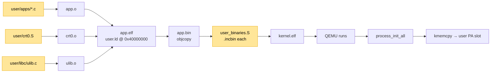
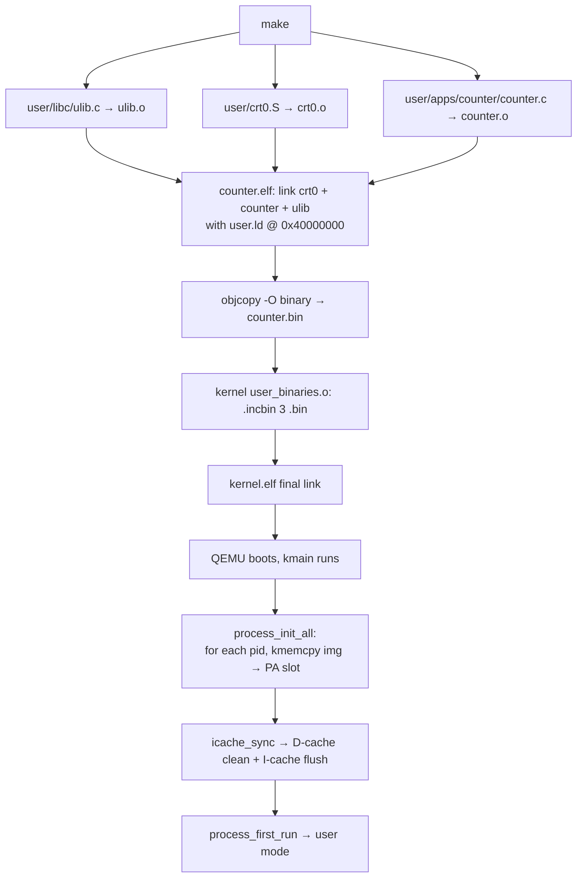

# Chapter 08 — Userspace: C programs running outside the kernel

<a id="english"></a>

**English** · [Tiếng Việt](#tiếng-việt)

> The kernel has syscalls, 3 PCBs already own a 1 MB user PA slot each, but the
> "program" running at `0x40000000` is still a shared copy-pasted assembly stub.
> This chapter turns it into 3 **separate** C programs: each one has its own
> `main()`, builds into its own `.bin`, the kernel embeds them into the image
> via `.incbin`, then loads each binary into the correct process's PA slot.
> Result: instead of a spin loop, counter keeps its own state, runaway deliberately
> hogs CPU without yielding, shell (in chapter 09) gets a place to sit.

---

## Where we are

Modules marked with ★ are **new in this chapter**.

```
┌──────────────────────────────────────────────────────┐
│ ★ User space (C programs, linked at 0x40000000)     │
│                                                      │
│   ┌──────────────┐  ┌──────────────┐  ┌──────────┐  │
│   │ counter.c    │  │ runaway.c    │  │ shell.c  │  │
│   │  main(): ulib│  │  main(): busy│  │ (chap 09)│  │
│   │  _tag + putu │  │   loop no    │  │          │  │
│   │  + yield     │  │   yield      │  │          │  │
│   └──────┬───────┘  └──────┬───────┘  └─────┬────┘  │
│          ↓                 ↓                ↓        │
│   ┌──────────────────────────────────────────────┐  │
│   │ ★ crt0.S — _ustart: bl main; bl sys_exit    │  │
│   └──────────────────────────────────────────────┘  │
│   ┌──────────────────────────────────────────────┐  │
│   │ ★ libc/ — ulib_puts/putu/putc/tag/strlen…   │  │
│   │           syscall.h inline wrappers          │  │
│   └──────────────────────────────────────────────┘  │
└──────────────────────────────────────────────────────┘
━━━━━━━━━━━━━━━━━━━━━━━━━━━━━━━━━━━━━━━━━━━━━━━━━━━━━━━
┌──────────────────────────────────────────────────────┐
│                    Kernel                            │
│                                                      │
│   ┌──────────────────────────────────────────────┐  │
│   │ ★ user_binaries.S (.incbin × 3)             │  │
│   │   _counter_img_start / _end                  │  │
│   │   _runaway_img_start / _end                  │  │
│   │   _shell_img_start   / _end                  │  │
│   └──────────────────────────────────────────────┘  │
│   ┌──────────────────────────────────────────────┐  │
│   │ ★ process_init_all per-pid load             │  │
│   │     kmemcpy(user_va, img->start, len)        │  │
│   │     icache_sync(user_va, len)                │  │
│   └──────────────────────────────────────────────┘  │
│                                                      │
│   Scheduler · Syscall · MMU · IRQ · UART            │
└──────────────────────────────────────────────────────┘
```

**Build flow:**



---

## Principles

### Two worlds, two linkers, two runtimes

Kernel and user are completely different kinds of code:

| | Kernel | User |
|---|---|---|
| Linked at | VA `0xC0100000` | VA `0x40000000` |
| Entry | `_start` (start.S) | `_ustart` (crt0.S) |
| Contains | libgcc + drivers + everything | Only hand-written: crt0 + ulib |
| Stops via | halt loop / panic | `sys_exit` |
| Build | 1 large ELF | N small ELFs (N = number of apps) |

Same toolchain (`arm-none-eabi-gcc`), same flags `-nostdlib -ffreestanding`, but
two independent compilation trajectories. The kernel knows nothing about user C
code; user knows only the syscall ABI.

### crt0 — the minimal entry point

The kernel context switch into user mode sets PC = `USER_VIRT_BASE = 0x40000000`.
The first byte there must be a function — not `main` (C refuses to stand on its
own — it expects a caller) but the **C runtime 0** (crt0):

```asm
_ustart:
    bl      main
    bl      __noreturn_sys_exit   @ if main returns, exit immediately
1:  b       1b

__noreturn_sys_exit:
    mov     r7, #3                @ SYS_EXIT
    svc     #0
2:  b       2b
```

crt0's job:
- Ensure `main` is called correctly (has a frame, `lr` points to `bl main`+4).
- If `main` returns (implicitly — "end of function" in C), call `sys_exit`
  instead of falling into garbage.
- SP_usr is already set by the kernel in the initial frame (= `USER_STACK_TOP`).
  crt0 doesn't touch SP.

On real Linux, crt0 also reads `argc/argv/envp` from the stack and sets up the
heap. Here there's nothing on the stack at entry → crt0 stays tiny.

### Minimal libc: wrap syscalls, nothing more

Three essential functions:

1. **Syscall wrappers** ([user/libc/syscall.h](../../user/libc/syscall.h)) —
   inline asm that wraps each syscall as a C function. Covered in chapter 07.
2. **Print helpers** ([user/libc/ulib.c](../../user/libc/ulib.c)) —
   `ulib_puts`, `ulib_putu` (unsigned decimal), `ulib_putc`, `ulib_tag` (prints
   `[pid N] `). All built on `sys_write`.
3. **String helpers** — `ulib_strlen`, `ulib_strcmp`, `ulib_strncmp`,
   `ulib_atoi` for shell parsing (chapter 09).

No `malloc`, no `FILE*`, no `errno`. User program mainloop pattern:
```c
int main(void) {
    for (;;) {
        ulib_tag();
        ulib_puts("count=");
        ulib_putu(count++);
        ulib_putc('\n');
        busy_delay(...);
        sys_yield();
    }
}
```

### Embedding binaries with `.incbin`

On regular Linux, the kernel loads user ELFs from the filesystem via `execve`.
RingNova has no filesystem. Solution: **build each user binary separately into a
flat `.bin`, then bundle them into the kernel ELF at link time.**

[kernel/arch/arm/proc/user_binaries.S](../../kernel/arch/arm/proc/user_binaries.S):
```asm
.section .user_binaries, "a"
.align 4

.global _counter_img_start, _counter_img_end
_counter_img_start:
    .incbin "build/user/counter.bin"
_counter_img_end:

/* same for runaway and shell */
```

`.incbin` = "include binary file as-is at this position". The assembler reads
`counter.bin` at build time and splices its bytes into the object. The kernel
linker places section `.user_binaries` somewhere in the ELF (next to `.text`).

On the C side (`process_init_all`) we have symbol pointers:
```c
extern uint8_t _counter_img_start[], _counter_img_end[];
/* ... */
static const user_image_t user_images[NUM_PROCESSES] = {
    { "counter", _counter_img_start, _counter_img_end },
    { "runaway", _runaway_img_start, _runaway_img_end },
    { "shell",   _shell_img_start,   _shell_img_end   },
};
```

---

## Context

```
State before chapter 08:
- user_binaries.S: 3 separate user programs (.incbin), copied into per-process PA slots
- Syscall ABI: 4 Tier-1 calls ready (chapter 07)
- MMU: proc_pgd[i] maps VA 0x40000000 → each process's own user PA slot
- Fault isolation: user crash doesn't kill the kernel (chapter 07)
```

User mode does exactly one thing: spin. Each process needs DIFFERENT code to
actually demo multi-process behavior.

---

## Problems

1. **No user project structure.** We need a directory tree, linker script,
   Makefile rules — everything has to build independently of the kernel but
   still bundle in.
2. **The kernel has no per-pid binary load mechanism.** User binaries are currently
   embedded via extern `_*_img_start[]`. We need to dispatch "pid i → binary i".
3. **Cache coherency.** The kernel writes user bytes via the D-path (memcpy
   goes through D-cache). The user's I-fetch goes through I-cache. Without
   cleaning D-cache + invalidating I-cache before user runs, the user reads
   stale RAM (zeros or garbage).
4. **Linker VMA/LMA alignment.** `.user_binaries` has 16-byte alignment. If
   `.text` ends on a 4-byte boundary, the `.user_binaries` VMA pads up to 16
   but the LMA doesn't pad in sync → the bytes in `.bin` end up 4 bytes off
   from where the kernel expects them.

---

## Design

### User directory layout

```
user/
├── crt0.S                     ← _ustart → main → sys_exit
├── libc/
│   ├── syscall.h              ← inline wrappers (Tier 1 + Tier 2)
│   ├── ulib.h
│   └── ulib.c                 ← puts/putu/putc/tag/str*
├── linker/
│   └── user.ld                ← 1 MB @ 0x40000000
└── apps/
    ├── counter/counter.c
    ├── runaway/runaway.c
    └── shell/shell.c
```

One shared linker script for every app — user address layout is always the
same shape: text + rodata + data + bss in `[0x40000000, 0x40100000)`, stack_top
= end.

### user.ld — link at an absolute VA

```
ENTRY(_ustart)

MEMORY { USER (rwx) : ORIGIN = 0x40000000, LENGTH = 1M }

SECTIONS {
    .text : {
        KEEP(*(.text._ustart))    /* crt0 entry MUST come first */
        *(.text*)
        *(.rodata*)
    } > USER

    .data : { *(.data*) } > USER
    .bss  : { _ubss_start = .; *(.bss*) *(COMMON); _ubss_end = .; } > USER
}
```

`KEEP(*(.text._ustart))` guarantees `_ustart` sits at offset 0 of the binary.
The kernel sets initial PC = `USER_VIRT_BASE = 0x40000000` = `_ustart`. Without
crt0 at the head, user execution enters `main` bypassing the "if main returns
call sys_exit" step → if main returns, PC runs into junk bytes.

### Makefile: 3 auto-generated app rules

Each app needs: compile main.c + crt0.o + ulib.o → ELF → `.bin`. Use the
`$(foreach ...$(eval $(call ...)))` pattern to avoid writing it three times:

```make
USER_APPS := counter runaway shell

define USER_APP_RULES
$(USER_DIR)/$(1).elf: $(USER_CRT0_OBJ) $(USER_DIR)/apps/$(1)/$(1).o $(USER_LIBC_OBJS) $(USER_LDSCRIPT)
	$(CC) $(UCFLAGS) -T $(USER_LDSCRIPT) -o $$@ \
	      $(USER_CRT0_OBJ) $(USER_DIR)/apps/$(1)/$(1).o $(USER_LIBC_OBJS)

$(USER_DIR)/$(1).bin: $(USER_DIR)/$(1).elf
	$(OBJCOPY) -O binary $$< $$@
endef

$(foreach a,$(USER_APPS),$(eval $(call USER_APP_RULES,$(a))))
```

Dependency: `kernel.elf` needs `user_binaries.o` which needs every `*.bin` —
Make chains the order automatically:

```make
$(OBJ_DIR)/kernel/arch/arm/proc/user_binaries.o: $(USER_BINS)
```

### Per-pid binary load

`process_init_all` looks up `user_images[i]` by pid:

```c
for (uint32_t i = 0; i < NUM_PROCESSES; i++) {
    const user_image_t *img = &user_images[i];
    uint32_t img_size = img->end - img->start;

    void *user_va = (void *)(p->user_phys_base + PHYS_OFFSET);
    kmemset(user_va, 0, USER_REGION_SIZE);
    kmemcpy(user_va, img->start, img_size);
    icache_sync(user_va, img_size);       /* D-clean + I-invalidate */
    /* ... */
}
```

We write through the high-VA alias (`0xC0200000`, `0xC0300000`, `0xC0400000`)
instead of the PA directly — the identity map was dropped after chapter 03,
PA 0x70... is no longer accessible.

### Cache coherency

ARMv7-A has separate L1 I-cache + L1 D-cache. Kernel memcpy goes through the
D-path:
- Bytes land in D-cache, may not have reached memory yet.
- User I-fetch goes through I-cache → reads memory → doesn't see the D-cache
  bytes.

Fix: `icache_sync(va, len)`:
```c
static void icache_sync(void *va, uint32_t len) {
    uintptr_t start = (uintptr_t)va & ~(uintptr_t)31;
    uintptr_t end   = (uintptr_t)va + len;
    for (uintptr_t a = start; a < end; a += 32)
        __asm__ volatile("mcr p15, 0, %0, c7, c11, 1" :: "r"(a)); /* DCCMVAU */
    __asm__ volatile("dsb" ::: "memory");
    __asm__ volatile("mcr p15, 0, %0, c7, c5, 0" :: "r"(0));      /* ICIALLU */
    __asm__ volatile("dsb" ::: "memory");
    __asm__ volatile("isb" ::: "memory");
}
```

`DCCMVAU` = "Data Cache Clean by VA to Point of Unification" — pushes D-cache
lines down to the PoU per cache line. `ICIALLU` = invalidate the entire
I-cache. `DSB + ISB` enforce ordering.

We also add `ICIALLU` to `context_switch` (chapter 06): after the TTBR0 swap,
the same VA maps to a different PA — the old I-cache is no longer valid.

### Linker alignment fix

`.user_binaries` requires 16-byte alignment. If `.text` ends at `ALIGN(4)`, the
two sections drift:

```
.text   VMA 0xC0100000 → 0xC0103E1C (size 0x3E1C, ALIGN 4 at end)
        LMA 0x70100000 → 0x70103E1C

.user_binaries VMA continues but ALIGN(16) forces it up to 0xC0103E20 (+4)
               LMA runs straight from 0x70103E1C (no pad)
```

VMA is at 0xC0103E20 but LMA is at 0x70103E1C → 4-byte mismatch between where
the kernel reads (VMA) and where QEMU places the bytes (LMA). Result:
`_counter_img_start` at VMA 0xC0103E20 contains bytes from file offset `+0x60`
instead of `+0x64` — user bootstrap drops straight into `bl sys_exit`.

Fix: force `.text` to end at `ALIGN(16)`:

```ld
.text : {
    /* ... */
    . = ALIGN(16);   /* keep LMA/VMA in sync with next section */
    _text_end = .;
} > VIRT AT> PHYS
```

---

## How it works

### End-to-end build



### Per-pid runtime dispatch

```
boot log:
[PROC] pid=0 name=counter ... img=723 bytes
[PROC] pid=1 name=runaway ... img=723 bytes
[PROC] pid=2 name=shell   ... img=883 bytes
```

Each process now has its own image. 3 instances of the same `bl main` but each
`main` is completely different.

---

## Implementation

### Files

| File | Role |
|---|---|
| [user/crt0.S](../../user/crt0.S) | Entry stub |
| [user/libc/syscall.h](../../user/libc/syscall.h) | Inline syscall wrappers |
| [user/libc/ulib.{c,h}](../../user/libc/ulib.c) | Print + string helpers |
| [user/linker/user.ld](../../user/linker/user.ld) | User linker script |
| [user/apps/counter/counter.c](../../user/apps/counter/counter.c) | pid 0 program |
| [user/apps/runaway/runaway.c](../../user/apps/runaway/runaway.c) | pid 1 program |
| [user/apps/shell/shell.c](../../user/apps/shell/shell.c) | pid 2 (placeholder, implemented in chap 09) |
| [kernel/arch/arm/proc/user_binaries.S](../../kernel/arch/arm/proc/user_binaries.S) | `.incbin` × 3 |
| [kernel/proc/process.c](../../kernel/proc/process.c) | `user_images[]` + `icache_sync` + per-pid `kmemcpy` |
| [Makefile](../../Makefile) | User build rules + kernel dependency |
| [kernel/linker/kernel_qemu.ld](../../kernel/linker/kernel_qemu.ld), [kernel_bbb.ld](../../kernel/linker/kernel_bbb.ld) | `.user_binaries` section + `.text` ALIGN(16) |

### Key points

**User compile flags** — lighter than kernel flags:
```make
UCFLAGS := -nostdlib -ffreestanding -nostartfiles \
           -mcpu=cortex-a8 -marm \
           -I user/libc \
           -Wall -Wextra -g
```

No `-DPLATFORM_*` because user code doesn't depend on specific hardware. No
`-I kernel/include` because user code is not allowed to touch kernel headers.

**Counter & runaway have different personalities** on purpose:

- `counter` calls `sys_yield` every iteration → cooperative. Runs smoothly.
- `runaway` **never** calls `sys_yield` → preemption test. If the kernel loses
  its ability to preempt, runaway hogs the CPU forever and counter stops
  printing. If counter keeps ticking steadily = preemption is working.

---

## Testing

**Boot log:**
```
[PROC] pid=0 name=counter pgd=0x... user_pa=0x70200000 img=723 bytes
[PROC] pid=1 name=runaway pgd=0x... user_pa=0x70300000 img=723 bytes
[PROC] pid=2 name=shell   pgd=0x... user_pa=0x70400000 img=883 bytes
```

Each process loads a different binary (same size = 0 → memcpy bug or `.incbin`
pointing to the wrong file).

**Runtime — per-process output:**
```
[pid 0] count=0
[pid 0] count=1
[pid 1] runaway started — silent, no sys_yield
[pid 0] count=2
```

Seeing different `[pid X]` for the first time → `sys_getpid` returns the right
pid in each process's context → dispatch + context_switch work correctly.

**Preemption smoke test:** runaway hogs CPU forever but counter still makes
progress → the timer IRQ is able to preempt runaway.

---

## Links

### Dependencies

- **Chapter 06 — Scheduler**: context_switch, `process_first_run`.
- **Chapter 07 — Syscall**: ABI for user wrappers + handlers for the 4 Tier-1
  calls.
- **Chapter 05 — Process**: PCB + initial kernel stack frame + per-pid user PA
  slot.
- **Chapter 03 — MMU**: `mmu_drop_identity` — why user VA must be written
  through the high-VA alias from the kernel.

### Next

**Chapter 09 — Shell →** shell.c is currently just a placeholder. Turning it
into a real shell needs three new syscalls (`sys_read` blocking on UART RX IRQ
+ BLOCKED state, `sys_ps`, `sys_kill`) plus line-parsing logic and dispatch
for 6 commands. That's the final chapter — assembling every primitive we've
built into one interactive system.

---

<a id="tiếng-việt"></a>

**Tiếng Việt** · [English](#english)

> Kernel đã có syscall, 3 PCB đã có slot 1 MB user PA, nhưng "chương trình" đang chạy
> ở `0x40000000` vẫn là một đoạn assembly dùng chung copy-paste. Chapter này biến nó
> thành 3 chương trình C **tách biệt**: mỗi cái có `main()` riêng, build riêng thành
> `.bin`, kernel embed vào image qua `.incbin`, rồi nạp mỗi binary vào slot PA của
> đúng process. Kết quả: thay vì spin loop, counter đếm số có state riêng, runaway
> cố tình ngốn CPU không yield, shell (đến chapter 09) có chỗ ngồi.

---

## Đã xây dựng đến đâu

Module có dấu ★ là **mới trong chapter này**.

```
┌──────────────────────────────────────────────────────┐
│ ★ User space (C programs, linked at 0x40000000)     │
│                                                      │
│   ┌──────────────┐  ┌──────────────┐  ┌──────────┐  │
│   │ counter.c    │  │ runaway.c    │  │ shell.c  │  │
│   │  main(): ulib│  │  main(): busy│  │ (chap 09)│  │
│   │  _tag + putu │  │   loop no    │  │          │  │
│   │  + yield     │  │   yield      │  │          │  │
│   └──────┬───────┘  └──────┬───────┘  └─────┬────┘  │
│          ↓                 ↓                ↓        │
│   ┌──────────────────────────────────────────────┐  │
│   │ ★ crt0.S — _ustart: bl main; bl sys_exit    │  │
│   └──────────────────────────────────────────────┘  │
│   ┌──────────────────────────────────────────────┐  │
│   │ ★ libc/ — ulib_puts/putu/putc/tag/strlen…   │  │
│   │           syscall.h inline wrappers          │  │
│   └──────────────────────────────────────────────┘  │
└──────────────────────────────────────────────────────┘
━━━━━━━━━━━━━━━━━━━━━━━━━━━━━━━━━━━━━━━━━━━━━━━━━━━━━━━
┌──────────────────────────────────────────────────────┐
│                    Kernel                            │
│                                                      │
│   ┌──────────────────────────────────────────────┐  │
│   │ ★ user_binaries.S (.incbin × 3)             │  │
│   │   _counter_img_start / _end                  │  │
│   │   _runaway_img_start / _end                  │  │
│   │   _shell_img_start   / _end                  │  │
│   └──────────────────────────────────────────────┘  │
│   ┌──────────────────────────────────────────────┐  │
│   │ ★ process_init_all per-pid load             │  │
│   │     kmemcpy(user_va, img->start, len)        │  │
│   │     icache_sync(user_va, len)                │  │
│   └──────────────────────────────────────────────┘  │
│                                                      │
│   Scheduler · Syscall · MMU · IRQ · UART            │
└──────────────────────────────────────────────────────┘
```

**Build flow:**


---

## Nguyên lý

### Hai thế giới, hai linker, hai runtime

Kernel và user là hai loại code hoàn toàn khác nhau:

| | Kernel | User |
|---|---|---|
| Linked at | VA `0xC0100000` | VA `0x40000000` |
| Entry | `_start` (start.S) | `_ustart` (crt0.S) |
| Có gì | libgcc + driver + mọi thứ | Chỉ những gì tự viết: crt0 + ulib |
| Stop bằng | halt loop / panic | `sys_exit` |
| Build | 1 ELF lớn | N ELF nhỏ (N = số app) |

Cùng toolchain (`arm-none-eabi-gcc`), cùng flags `-nostdlib -ffreestanding`, nhưng
hai quỹ đạo biên dịch độc lập. Kernel không biết C code user đang làm gì; user chỉ
biết duy nhất ABI syscall.

### crt0 — entry point tối thiểu

Kernel context switch vào user mode đặt PC = `USER_VIRT_BASE = 0x40000000`. Byte
đầu tiên ở đó phải là một hàm, không phải `main` (C không chịu đứng một mình —
nó expect caller) mà là **C runtime 0** (crt0):

```asm
_ustart:
    bl      main
    bl      __noreturn_sys_exit   @ nếu main return, exit luôn
1:  b       1b

__noreturn_sys_exit:
    mov     r7, #3                @ SYS_EXIT
    svc     #0
2:  b       2b
```

Vai trò crt0:
- Đảm bảo `main` được gọi đúng cách (có frame, `lr` trỏ về `bl main`+4).
- Nếu `main` return (implicit — "end of function" trong C) thì `sys_exit` thay vì
  rơi vào rác.
- SP_usr đã được kernel set sẵn trong initial frame (= `USER_STACK_TOP`). crt0
  không cần đụng SP.

Trên Linux thật, crt0 còn đọc `argc/argv/envp` từ stack và setup heap. Ở đây
không có gì trong stack lúc entry → crt0 cực gọn.

### Minimal libc: bọc syscall, không hơn

Ba chức năng thiết yếu:

1. **Syscall wrappers** ([user/libc/syscall.h](../../user/libc/syscall.h)) — inline
   asm bọc mỗi syscall thành hàm C. Đã bàn ở chapter 07.
2. **Print helpers** ([user/libc/ulib.c](../../user/libc/ulib.c)) — `ulib_puts`,
   `ulib_putu` (unsigned decimal), `ulib_putc`, `ulib_tag` (in `[pid N] `). Đều
   build trên `sys_write`.
3. **String helpers** — `ulib_strlen`, `ulib_strcmp`, `ulib_strncmp`, `ulib_atoi`
   cho shell parsing (chapter 09).

Không có `malloc`, không có `FILE*`, không có `errno`. User program mainloop
pattern:
```c
int main(void) {
    for (;;) {
        ulib_tag();
        ulib_puts("count=");
        ulib_putu(count++);
        ulib_putc('\n');
        busy_delay(...);
        sys_yield();
    }
}
```

### Embed binary bằng `.incbin`

Trên Linux bình thường, kernel load user ELF từ filesystem qua `execve`. RingNova
không có filesystem. Giải pháp: **build user binary riêng thành `.bin` flat, rồi
bundle vào kernel ELF tại link time.**

[kernel/arch/arm/proc/user_binaries.S](../../kernel/arch/arm/proc/user_binaries.S):
```asm
.section .user_binaries, "a"
.align 4

.global _counter_img_start, _counter_img_end
_counter_img_start:
    .incbin "build/user/counter.bin"
_counter_img_end:

/* tương tự cho runaway và shell */
```

`.incbin` = "include binary file as-is at this position". Assembler đọc file
`counter.bin` tại build time và chèn bytes vào object. Kernel linker đặt section
`.user_binaries` vào một chỗ trong ELF (cạnh `.text`).

C side (`process_init_all`) có symbol pointers:
```c
extern uint8_t _counter_img_start[], _counter_img_end[];
/* ... */
static const user_image_t user_images[NUM_PROCESSES] = {
    { "counter", _counter_img_start, _counter_img_end },
    { "runaway", _runaway_img_start, _runaway_img_end },
    { "shell",   _shell_img_start,   _shell_img_end   },
};
```

---

## Bối cảnh

```
Trạng thái trước chapter 08:
- User_stub.S: 1 file asm chung, copy-paste vào 3 process (chapter 05)
- Syscall ABI: 4 Tier-1 sẵn sàng (chapter 07)
- MMU: proc_pgd[i] map VA 0x40000000 → user PA slot riêng
- Fault isolation: user crash không giết kernel (chapter 07)
```

User mode làm được 1 thứ: spin. Mỗi process cần code KHÁC để demo multi-process
thật sự.

---

## Vấn đề

1. **Không có cấu trúc project user.** Cần thư mục, linker script, Makefile rules —
   toàn bộ cần build độc lập khỏi kernel nhưng vẫn bundle được.
2. **Kernel không có cơ chế load binary theo pid.** User binary hiện được nhúng
   qua extern `_*_img_start[]`. Cần dispatch "pid i → binary i".
3. **Cache coherency.** Kernel ghi user bytes qua D-path (memcpy đi qua D-cache).
   User I-fetch đi qua I-cache. Nếu không clean D-cache + invalidate I-cache trước
   khi user chạy, user đọc RAM cũ (zero hoặc rác).
4. **Linker VMA/LMA alignment.** `.user_binaries` có alignment 16 bytes. Nếu `.text`
   kết ở biên 4 byte, VMA `.user_binaries` pad lên 16 nhưng LMA không pad đồng bộ
   → bytes trong `.bin` nằm lệch 4 byte so với chỗ kernel expect.

---

## Thiết kế

### Layout thư mục user

```
user/
├── crt0.S                     ← _ustart → main → sys_exit
├── libc/
│   ├── syscall.h              ← inline wrappers (Tier 1 + Tier 2)
│   ├── ulib.h
│   └── ulib.c                 ← puts/putu/putc/tag/str*
├── linker/
│   └── user.ld                ← 1 MB @ 0x40000000
└── apps/
    ├── counter/counter.c
    ├── runaway/runaway.c
    └── shell/shell.c
```

1 linker script dùng chung cho mọi app — vì layout địa chỉ của user luôn cùng
kiểu: text + rodata + data + bss ở `[0x40000000, 0x40100000)`, stack_top = end.

### user.ld — link tại absolute VA

```
ENTRY(_ustart)

MEMORY { USER (rwx) : ORIGIN = 0x40000000, LENGTH = 1M }

SECTIONS {
    .text : {
        KEEP(*(.text._ustart))    /* crt0 entry PHẢI first */
        *(.text*)
        *(.rodata*)
    } > USER

    .data : { *(.data*) } > USER
    .bss  : { _ubss_start = .; *(.bss*) *(COMMON); _ubss_end = .; } > USER
}
```

`KEEP(*(.text._ustart))` đảm bảo `_ustart` đặt tại offset 0 của binary. Kernel
set initial PC = `USER_VIRT_BASE = 0x40000000` = `_ustart`. Không có crt0 đứng
đầu → user run vào `main` bỏ qua bước "nếu main return thì sys_exit" → nếu
main return sẽ PC chạy vào junk bytes.

### Makefile: 3 app rules tự sinh

Mỗi app cần: compile main.c + crt0.o + ulib.o → ELF → `.bin`. Dùng
`$(foreach ...$(eval $(call ...)))` pattern để tránh viết 3 lần:

```make
USER_APPS := counter runaway shell

define USER_APP_RULES
$(USER_DIR)/$(1).elf: $(USER_CRT0_OBJ) $(USER_DIR)/apps/$(1)/$(1).o $(USER_LIBC_OBJS) $(USER_LDSCRIPT)
	$(CC) $(UCFLAGS) -T $(USER_LDSCRIPT) -o $$@ \
	      $(USER_CRT0_OBJ) $(USER_DIR)/apps/$(1)/$(1).o $(USER_LIBC_OBJS)

$(USER_DIR)/$(1).bin: $(USER_DIR)/$(1).elf
	$(OBJCOPY) -O binary $$< $$@
endef

$(foreach a,$(USER_APPS),$(eval $(call USER_APP_RULES,$(a))))
```

Dependency: `kernel.elf` cần `user_binaries.o` cần tất cả `*.bin` — Make chain
tự lo thứ tự:

```make
$(OBJ_DIR)/kernel/arch/arm/proc/user_binaries.o: $(USER_BINS)
```

### Per-pid binary load

`process_init_all` lookup `user_images[i]` theo pid:

```c
for (uint32_t i = 0; i < NUM_PROCESSES; i++) {
    const user_image_t *img = &user_images[i];
    uint32_t img_size = img->end - img->start;

    void *user_va = (void *)(p->user_phys_base + PHYS_OFFSET);
    kmemset(user_va, 0, USER_REGION_SIZE);
    kmemcpy(user_va, img->start, img_size);
    icache_sync(user_va, img_size);       /* D-clean + I-invalidate */
    /* ... */
}
```

Ghi qua high-VA alias (`0xC0200000`, `0xC0300000`, `0xC0400000`) thay vì PA trực
tiếp — identity map đã drop sau chapter 03, PA 0x70... không còn accessible.

### Cache coherency

ARMv7-A có L1 I-cache + L1 D-cache tách biệt. Kernel memcpy đi qua D-path:
- Bytes vào D-cache, có thể chưa xuống memory.
- User I-fetch đi qua I-cache → đọc memory → không thấy bytes D-cache.

Fix: `icache_sync(va, len)`:
```c
static void icache_sync(void *va, uint32_t len) {
    uintptr_t start = (uintptr_t)va & ~(uintptr_t)31;
    uintptr_t end   = (uintptr_t)va + len;
    for (uintptr_t a = start; a < end; a += 32)
        __asm__ volatile("mcr p15, 0, %0, c7, c11, 1" :: "r"(a)); /* DCCMVAU */
    __asm__ volatile("dsb" ::: "memory");
    __asm__ volatile("mcr p15, 0, %0, c7, c5, 0" :: "r"(0));      /* ICIALLU */
    __asm__ volatile("dsb" ::: "memory");
    __asm__ volatile("isb" ::: "memory");
}
```

`DCCMVAU` = "Data Cache Clean by VA to Point of Unification" — đẩy D-cache
lines xuống PoU cho mỗi cache line. `ICIALLU` = invalidate toàn bộ I-cache.
`DSB + ISB` để đảm bảo thứ tự.

Cũng thêm `ICIALLU` vào `context_switch` (chapter 06): sau TTBR0 swap, cùng VA
ánh xạ sang PA khác — I-cache cũ không hợp lệ nữa.

### Linker alignment fix

`.user_binaries` yêu cầu alignment 16 byte. Nếu `.text` kết ở `ALIGN(4)`, hai
section drift:

```
.text   VMA 0xC0100000 → 0xC0103E1C (size 0x3E1C, ALIGN 4 ở cuối)
        LMA 0x70100000 → 0x70103E1C

.user_binaries VMA tiếp tục nhưng bị ALIGN(16) ép lên 0xC0103E20 (+4)
               LMA đi thẳng từ 0x70103E1C (không pad)
```

VMA ở 0xC0103E20 nhưng LMA ở 0x70103E1C → chênh lệch 4 byte giữa nơi kernel
read (VMA) và nơi QEMU put bytes (LMA). Kết quả: `_counter_img_start` ở VMA
0xC0103E20 chứa bytes từ file offset `+0x60` thay vì `+0x64` — user bootstrap
rơi vào `bl sys_exit` ngay.

Fix: ép `.text` kết ở `ALIGN(16)`:

```ld
.text : {
    /* ... */
    . = ALIGN(16);   /* keep LMA/VMA in sync with next section */
    _text_end = .;
} > VIRT AT> PHYS
```

---

## Cách hoạt động

### Build end-to-end


### Per-pid runtime dispatch

```
boot log:
[PROC] pid=0 name=counter ... img=723 bytes
[PROC] pid=1 name=runaway ... img=723 bytes
[PROC] pid=2 name=shell   ... img=883 bytes
```

Mỗi process giờ có image riêng. 3 instance của cùng `bl main` nhưng `main` khác
hoàn toàn.

---

## Implementation

### Files

| File | Vai trò |
|---|---|
| [user/crt0.S](../../user/crt0.S) | Entry stub |
| [user/libc/syscall.h](../../user/libc/syscall.h) | Inline syscall wrappers |
| [user/libc/ulib.{c,h}](../../user/libc/ulib.c) | Print + string helpers |
| [user/linker/user.ld](../../user/linker/user.ld) | User linker script |
| [user/apps/counter/counter.c](../../user/apps/counter/counter.c) | pid 0 program |
| [user/apps/runaway/runaway.c](../../user/apps/runaway/runaway.c) | pid 1 program |
| [user/apps/shell/shell.c](../../user/apps/shell/shell.c) | pid 2 (placeholder, chap 09 impl) |
| [kernel/arch/arm/proc/user_binaries.S](../../kernel/arch/arm/proc/user_binaries.S) | `.incbin` × 3 |
| [kernel/proc/process.c](../../kernel/proc/process.c) | `user_images[]` + `icache_sync` + per-pid `kmemcpy` |
| [Makefile](../../Makefile) | User build rules + kernel dependency |
| [kernel/linker/kernel_qemu.ld](../../kernel/linker/kernel_qemu.ld), [kernel_bbb.ld](../../kernel/linker/kernel_bbb.ld) | `.user_binaries` section + `.text` ALIGN(16) |

### Điểm chính

**User compile flags** — nhẹ hơn kernel flags:
```make
UCFLAGS := -nostdlib -ffreestanding -nostartfiles \
           -mcpu=cortex-a8 -marm \
           -I user/libc \
           -Wall -Wextra -g
```

Không có `-DPLATFORM_*` vì user code không phụ thuộc hardware cụ thể. Không có
`-I kernel/include` vì user không được phép chạm kernel header.

**Counter & runaway khác tính cách** có mục đích:

- `counter` gọi `sys_yield` mỗi vòng → cooperative. Chạy smooth, đẹp.
- `runaway` **không bao giờ** gọi `sys_yield` → preemption test. Nếu kernel mất
  khả năng preempt, runaway sẽ chiếm CPU mãi và counter ngừng in. Nhìn counter
  vẫn tăng đều = preemption vẫn work.

---

## Testing

**Boot log:**
```
[PROC] pid=0 name=counter pgd=0x... user_pa=0x70200000 img=723 bytes
[PROC] pid=1 name=runaway pgd=0x... user_pa=0x70300000 img=723 bytes
[PROC] pid=2 name=shell   pgd=0x... user_pa=0x70400000 img=883 bytes
```

Mỗi process load binary khác (cùng size = 0 → bug memcpy hoặc `.incbin` trỏ sai
file).

**Runtime — per-process output:**
```
[pid 0] count=0
[pid 0] count=1
[pid 1] runaway started — silent, no sys_yield
[pid 0] count=2
```

Lần đầu thấy `[pid X]` khác nhau → `sys_getpid` trả đúng pid trong context mỗi
process → dispatch + context_switch hoạt động đúng.

**Preemption smoke:** runaway ngốn CPU vô hạn nhưng counter vẫn tiến triển → timer
IRQ preempt được runaway.

---

## Liên kết

### Dependencies

- **Chapter 06 — Scheduler**: context_switch, `process_first_run`.
- **Chapter 07 — Syscall**: ABI cho user wrappers + handlers cho 4 Tier-1.
- **Chapter 05 — Process**: PCB + initial kernel stack frame + per-pid user PA slot.
- **Chapter 03 — MMU**: `mmu_drop_identity` cho tại sao user VA phải dùng high-VA alias khi kernel ghi.

### Tiếp theo

**Chapter 09 — Shell →** shell.c hiện mới là placeholder. Để thành shell thật cần
ba syscall mới (`sys_read` blocking với UART RX IRQ + BLOCKED state, `sys_ps`,
`sys_kill`) và logic parse dòng + dispatch 6 lệnh. Đó là chapter cuối — tập hợp
toàn bộ primitives đã có thành một hệ thống tương tác.
